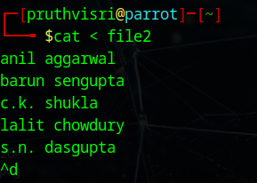
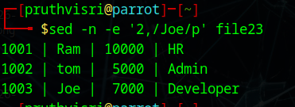

# OS-Linux-commands-Shell-scripting
Operating systems Lab exercise
# Linux commands-Shell scripting
Linux commands-Shell scripting

# AIM:
To practice Linux Commands and Shell Scripting

# DESIGN STEPS:

### Step 1:

Navigate to any Linux environment installed on the system or installed inside a virtual environment like virtual box/vmware or online linux JSLinux (https://bellard.org/jslinux/vm.html?url=alpine-x86.cfg&mem=192) or docker.

### Step 2:

Execute the following commands

### Step 3:

Testing the commands for the desired output. 

# COMMANDS:
### Create the following files file1, file2 as follows:
cat > file1
```
chanchal singhvi
c.k. shukla
s.n. dasgupta
sumit chakrobarty
^d
```
cat > file2
```
anil aggarwal
barun sengupta
c.k. shukla
lalit chowdury
s.n. dasgupta
^d
```
### Display the content of the files
cat < file1
## OUTPUT

imaone.png

cat < file2
## OUTPUT


# Comparing Files
cmp file1 file2
## OUTPUT
 
comm file1 file2
 ## OUTPUT

 
diff file1 file2
## OUTPUT


#Filters

### Create the following files file11, file22 as follows:

cat > file11
```
Hello world
This is my world
^d
```
cat > file22
```
1001 | Ram | 10000 | HR
1002 | tom |  5000 | Admin
1003 | Joe |  7000 | Developer
^d
```


cut -c1-3 file11
## OUTPUT


cut -d "|" -f 1 file22
## OUTPUT


cut -d "|" -f 2 file22
## OUTPUT


cat < newfile 
```
Hello world
hello world
^d
````
cat > newfile 
Hello world
hello world
 
grep Hello newfile 
## OUTPUT


grep hello newfile 
## OUTPUT


grep -v hello newfile 
## OUTPUT


cat newfile | grep -i "hello"
## OUTPUT


cat newfile | grep -i -c "hello"
## OUTPUT


grep -R ubuntu /etc
## OUTPUT


grep -w -n world newfile   
## OUTPUT


cat < newfile 
```
Hello world
hello world
Linux is world number 1
Unix is predecessor
Linux is best in this World
^d
```

cat > newfile
```
Hello world
hello world
Linux is world number 1
Unix is predecessor
Linux is best in this World
^d
 ```
egrep -w 'Hello|hello' newfile 
## OUTPUT


egrep -w '(H|h)ello' newfile 
## OUTPUT


egrep -w '(H|h)ell[a-z]' newfile 
## OUTPUT


egrep '(^hello)' newfile 
## OUTPUT


egrep '(world$)' newfile 
## OUTPUT


egrep '(World$)' newfile 
## OUTPUT


egrep '((W|w)orld$)' newfile 
## OUTPUT


egrep '[1-9]' newfile 
## OUTPUT


egrep 'Linux.*world' newfile 
## OUTPUT


egrep 'Linux.*World' newfile 
## OUTPUT


egrep l{2} newfile
## OUTPUT


egrep 's{1,2}' newfile
## OUTPUT 


cat > file23
```
1001 | Ram | 10000 | HR
1001 | Ram | 10000 | HR
1002 | tom |  5000 | Admin
1003 | Joe |  7000 | Developer
1005 | Sam |  5000 | HR
1004 | Sit |  7000 | Dev
1003 | Joe |  7000 | Developer
1001 | Ram | 10000 | HR
^d
```


sed -n -e '3p' file23
## OUTPUT


sed -n -e '$p' file23
## OUTPUT


sed  -e 's/Ram/Sita/' file23
## OUTPUT


sed  -e '2s/Ram/Sita/' file23
## OUTPUT


sed  '/tom/s/5000/6000/' file23
## OUTPUT


sed -n -e '1,5p' file23
## OUTPUT
ex37.png

sed -n -e '2,/Joe/p' file23
## OUTPUT




sed -n -e '/tom/,/Joe/p' file23
## OUTPUT


seq 10 
## OUTPUT


seq 10 | sed -n '4,6p'
## OUTPUT


seq 10 | sed -n '2,~4p'
## OUTPUT


seq 3 | sed '2a hello'
## OUTPUT


seq 2 | sed '2i hello'
## OUTPUT


seq 10 | sed '2,9c hello'
## OUTPUT


sed -n '2,4{s/^/$/;p}' file23
## OUTPUT


sed -n '2,4{s/$/*/;p}' file23


#Sorting File content
cat > file21
```
1001 | Ram | 10000 | HR
1002 | tom |  5000 | Admin
1003 | Joe |  7000 | Developer
1005 | Sam |  5000 | HR
1004 | Sit |  7000 | Dev
``` 

sort file21
## OUTPUT


cat > file22

```
1001 | Ram | 10000 | HR
1001 | Ram | 10000 | HR
1002 | tom |  5000 | Admin
1003 | Joe |  7000 | Developer
1005 | Sam |  5000 | HR
1004 | Sit |  7000 | Dev
```
 

uniq file22
## OUTPUT


#Using tr command


cat file23 | tr [:lower:] [:upper:]
 ## OUTPUT


cat < urllist.txt
```
www. yahoo. com
www. google. com
www. mrcet.... com
^d
 ```
cat > urllist.txt
```
www. yahoo. com
www. google. com
www. mrcet.... com
 ```
cat urllist.txt | tr -d ' '
 ## OUTPUT


 
cat urllist.txt | tr -d ' ' | tr -s '.'
## OUTPUT


#Backup commands
tar -cvf backup.tar *
## OUTPUT


mkdir backupdir
 
mv backup.tar backupdir

cd backupdir
 
tar -tvf backup.tar
## OUTPUT


tar -xvf backup.tar
## OUTPUT


gzip backup.tar

ls .gz
## OUTPUT


gunzip backup.tar.gz
## OUTPUT


# Shell Script


```
echo '#!/bin/sh' > my-script.sh
echo 'echo Hello World‘; exit 0 >> my-script.sh
```
chmod 755 my-script.sh
./my-script.sh
## OUTPUT


cat << stop > herecheck.txt
```
hello in this world
i cant stop
for this non stop movement
stop
```

cat herecheck.txt
## OUTPUT


cat < scriptest.sh 
```bash
\#!/bin/sh
echo “File name is $0 ”
echo "File name is " `basename $0`
echo “First arg. is ” $1
echo “Second arg. is ” $2
echo “Third arg. is ” $3
echo “Fourth arg. is ” $4
echo 'The $@ is ' $@
echo 'The $\# is ' $1#
echo 'The $$ is ' $$
ps
^d
 ```

cat scriptest.sh 
```bash
\#!/bin/sh
echo “File name is $0 ”
echo "File name is " `basename $0`
echo “First arg. is ” $1
echo “Second arg. is ” $2
echo “Third arg. is ” $3
echo “Fourth arg. is ” $4
echo 'The $@ is ' $@
echo 'The $\# is ' $\#
echo 'The $$ is ' $$
ps
```
 
chmod 777 scriptest.sh
 
./scriptest.sh 1 2 3

## OUTPUT

 
ls file1
## OUTPUT

echo $?
## OUTPUT 
./one
bash: ./one: Permission denied
 
echo $?
## OUTPUT 

abcd
 
echo $?
 ## OUTPUT


 
# mis-using string comparisons

cat < strcomp.sh 
```bash
\#!/bin/bash
val1=baseball
val2=hockey
if [ $val1 \> $val2 ]
then
echo "$val1 is greater than $val2"
else
echo "$val1 is less than $val2"
fi
^d
```

cat strcomp.sh 
```bash
\#!/bin/bash
val1=baseball
val2=hockey
if [ $val1 \> $val2 ]
then
echo "$val1 is greater than $val2"
else
echo "$val1 is less than $val2"
fi
```
##OUTPUT


chmod 755 strcomp.sh
 
./strcomp.sh 
## OUTPUT


# check file ownership

cat < psswdperm.sh 
```bash
\#!/bin/bash
if [ -O /etc/passwd ]
then
echo “You are the owner of the /etc/passwd file”
else
echo “Sorry, you are not the owner of the /etc/passwd file”
fi
^d
```

cat psswdperm.sh 
```bash
/#!/bin/bash
if [ -O /etc/passwd ]
then
echo “You are the owner of the /etc/passwd file”
else
echo “Sorry, you are not the owner of the /etc/passwd file”
fi
 ```
./psswdperm.sh
## OUTPUT


# check if with file location

cat>ifnested.sh 
```bash
\#!/bin/bash
if [ -e $HOME ]
then
echo “$HOME The object exists, is it a file?”
if [ -f $HOME ]
then
echo “Yes,$HOME it is a file!”
else
echo “No,$HOME it is not a file!”
if [ -f $HOME/.bash_history ]
then
echo “But $HOME/.bash_history is a file!”
fi
fi
else
echo “Sorry, the object does not exist”
fi
^d
```
cat ifnested.sh 
```
\#!/bin/bash
if [ -e $HOME ]
then
echo “$HOME The object exists, is it a file?”
if [ -f $HOME ]
then
echo “Yes,$HOME it is a file!”
else
echo “No,$HOME it is not a file!”
if [ -f $HOME/.bash_history ]
then
echo “But $HOME/.bash_history is a file!”
fi
fi
else
echo “Sorry, the object does not exist”
fi
```

./ifnested.sh 
## OUTPUT


# using numeric test comparisons
cat > iftest.sh 
```bash
\#!/bin/bash
val1=10
val2=11
if [ $val1 -gt 5 ]
then
echo “The test value $val1 is greater than 5”
fi
if [ $val1 -eq $val2 ]
then
echo “The values are equal”
else
echo “The values are different”
fi
^d
```


cat iftest.sh 
```bash
\#!/bin/bash
val1=10
val2=11
if [ $val1 -gt 5 ]
then
echo “The test value $val1 is greater than 5”
fi
if [ $val1 -eq $val2 ]
then
echo “The values are equal”
else
echo “The values are different”
fi
```

$ chmod 755 iftest.sh
 
$ ./iftest.sh 
##OUTPUT


# check if a file
cat > ifnested.sh 
```bash
\#!/bin/bash
if [ -e $HOME ]
then
echo “$HOME The object exists, is it a file?”
if [ -f $HOME ]
then
echo “Yes,$HOME it is a file!”
else
echo “No,$HOME it is not a file!”
if [ -f $HOME/.bash_history ]
then
echo “But $HOME/.bash_history is a file!”
fi
fi
else
echo “Sorry, the object does not exist”
fi
^d
```

cat ifnested.sh 
```bash
\#!/bin/bash
if [ -e $HOME ]
then
echo “$HOME The object exists, is it a file?”
if [ -f $HOME ]
then
echo “Yes,$HOME it is a file!”
else
echo “No,$HOME it is not a file!”
if [ -f $HOME/.bash_history ]
then
echo “But $HOME/.bash_history is a file!”
fi
fi
else
echo “Sorry, the object does not exist”
fi
```

$ chmod 755 ifnested.sh
 
$ ./ifnested.sh 
##OUTPUT


# looking for a possible value using elif
cat elifcheck.sh 
```bash
\#!/bin/bash
if [ $USER = Ram ]
then
echo "Welcome $USER"
echo "Please enjoy your visit"
elif [ $USER = Rahim ]
then
echo "Welcome $USER"
echo "Please enjoy your visit"
elif [ $USER = Robert ]
then
echo "Special testing account"
elif [ $USER = gganesh ]
then
echo "$USER, Do not forget to logout when you're done"
else
echo "Sorry, you are not allowed here"
fi
```

$ chmod 755 elifcheck.sh
 
$ ./elifcheck.sh 
## OUTPUT


# testing compound comparisons
cat> ifcompound.sh 
```bash
\#!/bin/bash
if [ -d $HOME ] && [ -w $HOME ]
then
echo "The file exists and you can write to it"
else
echo "I cannot write to the file"
fi
```
$ chmod 755 ifcompound.sh
$ ./ifcompound.sh 
## OUTPUT

# using the case command

cat >casecheck.sh 
```bash
case $USER in
Ram | Robert)
echo "Welcome, $USER"
echo "Please enjoy your visit";;
Rahim)
echo "Special testing account";;
gganesh)
echo "$USER, Do not forget to log off when you're done";;
*)
echo "Sorry, you are not allowed here";;
esac
```
$ chmod 755 casecheck.sh 
 
$ ./casecheck.sh 
 
cat > whiletest
```bash
#!/bin/bash
#while command test
var1=10
while [ $var1 -gt 0 ]
do
echo $var1
var1=$[ $var1 - 1 ]
done
```

$ chmod 755 whiletest.sh
 
$ ./whiletest.sh
 
 
cat untiltest.sh 
```bash
\#using the until command
var1=100
until [ $var1 -eq 0 ]
do
echo $var1
var1=$[ $var1 - 25 ]
done
``` 
$ chmod 755 untiltest.sh
 
 
 
cat forin1.sh 
```bash
\#!/bin/bash
\#basic for command
for test in Alabama Alaska Arizona Arkansas California Colorado
do
echo The next state is $test
done
 ```
 
$ chmod 755 forin1.sh
 
 
cat forin2.sh 
```bash
\#!/bin/bash
\# another example of how not to use the for command
for test in I don't know if this'll work
do
echo “word:$test”
done
 ```
 
$ chmod 755 forin2.sh
 
cat forin2.sh 
```bash
\#!/bin/bash
\# another example of how not to use the for command
for test in I don't know if this'll work
do
echo “word:$test”
done
```
$ chmod 755 forin2.sh
 
$ ./forin2.sh 
 
cat forin3.sh 
```bash
\#!/bin/bash
\# another example of how not to use the for command
for test in I don\'t know if "this'll" work
do
echo "word:$test"
done
```

$ ./forin3.sh 
 
cat forin1.sh 
```bash
#!/bin/bash
# basic for command
for test in Alabama Alaska Arizona Arkansas California Colorado
do
echo The next state is $test
done
```

$ chmod 755 forin1.sh

## OUTPUT
cat forinfile.sh 
```bash
#!/bin/bash
# reading values from a file
file="cities"
for state in `cat $file`
do
echo "Visit beautiful $file“
done
```
$ chmod 777 forinfile.sh
$ cat cities
Hyderabad
Alampur
Basara
Warangal
Adilabad
Bhadrachalam
Khammam

## OUTPUT


cat forctype.sh 
```bash
#!/bin/bash
# testing the C-style for loop
for (( i=1; i <= 5; i++ ))
do
echo "The value of i is $i"
done
````
$ chmod 755 forctype.sh
$ ./forctype.sh 
## OUTPUT

cat forctype1.sh 
```bash
#!/bin/bash
# multiple variables
for (( a=1, b=5; a <= 5; a++, b-- ))
do
echo "$a - $b"
done
```

$ chmod 755 forctype.sh
$ ./forctype1.sh 
## OUTPUT

cat fornested1.sh 
```bash
#!/bin/bash
# nesting for loops
for (( a = 1; a <= 3; a++ ))
do
echo "Starting loop $a:"
for (( b = 1; b <= 3; b++ ))
do
echo " Inside loop: $b"
done
done
```
$ chmod 755 fornested1.sh
 
$ ./fornested1.sh 
 ## OUTPUT


cat forbreak.sh 
```bash
#!/bin/bash
# breaking out of a for loop
for var1 in 1 2 3 4 5
do
if [ $var1 -eq 3 ]
then
break
fi
echo "Iteration number: $var1"
done
echo "The for loop is completed“
```
## OUTPUT

$ chmod 755 forbreak.sh
 
$ ./forbreak.sh 
 
cat forbreak.sh 
```bash
#!/bin/bash
# breaking out of a for loop
for var1 in 1 2 3 4 5
do
if [ $var1 -eq 3 ]
then
continue
fi
echo "Iteration number: $var1"
done
echo "The for loop is completed“
```

 
$ chmod 755 forcontinue.sh
 
$ ./forcontinue.sh 
## OUTPUT
 
cat exread.sh 
```bash
#!/bin/bash
# testing the read command
echo -n "Enter your name: "
read name
echo "Hello $name, welcome to my program. "
 ```
 
$ chmod 755 exread.sh 
 
$ ./exread.sh 
## OUTPUT


 cat exread1.sh
```bash
#!/bin/bash
# testing the read command
read -p "Enter your name: " name
echo "Hello $name, welcome to my program. “
``` 
$ chmod 755 exread1.sh 

## OUTPUT


$ ./exread1.sh 
 
cat funcex.sh
```bash
#!/bin/bash
# trying to access script parameters inside a function
function func {
echo $[ $1 * $2 ]
}
if [ $# -eq 2 ]
then
value=`func $1 $2`
echo "The result is $value"
else
echo "Usage: badtest1 a b"
fi
```
## OUTPUT

 ./funcex.sh 

 
 ./funcex.sh 1 2
 
cat argshift.sh
```bash
#!/bin/bash 
 while (( "$#" )); do 
  echo $1 
  shift 
done
```

$ chmod 777 argshift.sh

## OUTPUT

$ ./argshift.sh 1 2 3
 

 cat argshift1.sh
```bash
 #/bin/bash 
 # store arguments in a special array 
args=("$@") 
# get number of elements 
ELEMENTS=${#args[@]} 
 # echo each element in array  
# for loop 
for (( i=0;i<$ELEMENTS;i++)); do 
    echo ${args[${i}]} 
done
```
$ chmod 777 argshift.sh
## OUTPUT

$ ./argshift.sh 1 2 3
 
cat argshift.sh
```bash
#!/bin/bash 
set -x 
while (( "$#" )); do 
  echo $1 
  shift 
done
set +x
```
## OUTPUT
 ./argshift.sh 1 2 3
 
 
cat > nc.awk
```bash
BEGIN{}
{
print len=length($0),"\t",$0 
wordcount+=NF
chrcnt+=len
}
END {
print "total characters",chrcnt 
print "Number of Lines are",NR
print "No of Words count:",wordcount
}
 ```
cat>data.dat
```bash
bcdfghj
abcdfghj
bcdfghj
ebcdfghj
bcdfghj
ibcdfghj
bcdfghj
obcdfghj
bcdfghj
ubcdfghj
```

awk -f nc.awk data.dat
## OUTPUT 
 
cat > palindrome.sh
```bash
#num=545
echo "Enter the number"
read num
s=0
rev=""
temp=$num
while [ $num -gt 0 ]
do
	# Get Remainder
	s=$(( $num % 10 ))
	# Get next digit
	num=$(( $num / 10 ))
	# Store previous number and
	# current digit in reverse
	rev=$( echo ${rev}${s} )
done
if [ $temp -eq $rev ];
then
	echo "Number is palindrome"
else
	echo "Number is NOT palindrome"
fi
```
## OUTPUT 


# RESULT:
The Commands are executed successfully.
